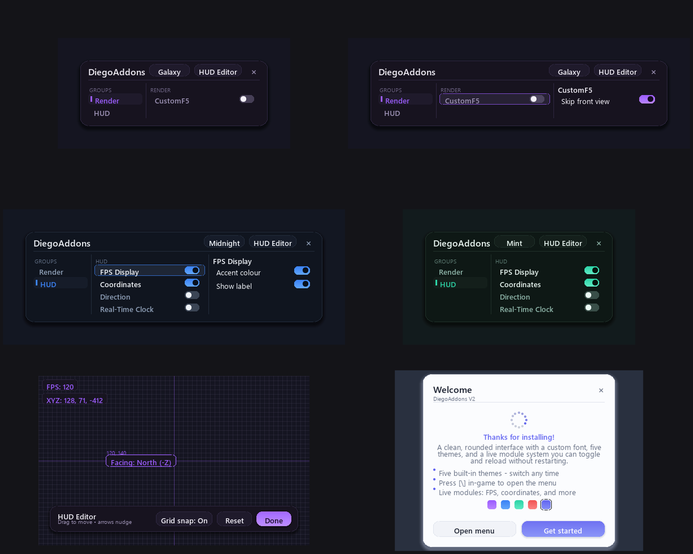

# DiegoAddons V2

A client-side Fabric mod for **Minecraft 26.1.2** providing a modern, web-app-style GUI toolkit
with a **custom font**, **smooth rounded components**, **5 themes**, a **live module system**, and a
**first-run introduction screen** with a round loading spinner.



*(The preview above is a high-fidelity mock rendered with the actual bundled font and the same
drawing primitives the mod uses.)*

## Features

- **Three-column ClickGUI** — a custom-drawn module menu in the style of module clients:
  **groups** (left) → **features** of the selected group (middle) → **feature-specific settings**
  (right, appears when you **right-click** a feature). Left-click a feature to toggle it. A theme
  switcher and the HUD Editor live in the header.
- **HUD editor** — a full-screen editor (from the ClickGUI header) to **drag your HUD elements**
  anywhere on screen, with a **reference grid**, optional grid-snapping, arrow-key nudging, and a
  Reset. Each element's position persists per-module.
- **Supersampled, high-res UI** — the ClickGUI and intro are drawn inside a pose scaled by
  `1/UiRender.SS` and laid out in "units" (1 unit = 1/SS screen pixel), so every corner, stroke and
  glyph resolves at **SS× the GUI-scale resolution**. The result is genuinely high-res — no chunky
  Minecraft-pixel blocks. The mod draws its own components (cards, gradient buttons, pill toggles,
  accent glows, soft drop shadows, a round loading spinner) instead of vanilla widgets, and rounded
  corners use **true 2-D distance anti-aliasing** on top of the supersampling for razor-smooth edges.
- **Custom font (not the Minecraft font)** — bundles **Poppins** (Regular / Medium / SemiBold /
  Bold, SIL Open Font License) as a TTF font provider in two families: a small **HUD family** for
  in-game chips, and a large **menu family** rasterised at SS× its visual size for the supersampled
  screens. All text renders as a clean, antialiased modern sans instead of the default bitmap font.
- **Grouped modules with settings** — HUD group: FPS Display, Coordinates, Direction, Real-Time
  Clock (each with *Accent colour* / *Show label* settings). Render group: **CustomF5** (with a
  *Skip front view* setting that skips the F5 front-facing camera).
- **5 themes** — Galaxy, Midnight, Mint, Crimson, Light (elevation-based palettes with a two-stop
  accent gradient). Cycle live from the ClickGUI header; the choice is saved instantly.
- **First-run intro screen** — shown once per instance (tracked by `introShown`).
- **Keybind** — press `\` (backslash) in-game to open the ClickGUI. Rebind under *Options › Controls*.

## Architecture

Each feature is a `module.Module` in a `module.Category`, with an `onEnable()` / `onDisable()`
lifecycle and an optional `onClientTick()`. `HudModule` subclasses supply a label + live value and
are drawn as themed HUD chips. Modules can expose `module.Setting`s (currently `BooleanSetting`),
rendered live in the ClickGUI's third column and persisted under `modules.<id>.options` in the config.

`ModuleManager` registers **exactly one** client-tick listener and **one** HUD element
(`HudElementRegistry.addLast`) at startup; these always-on hooks dispatch to the currently enabled
modules, so toggling a module is fully live (no registry churn). Note: this only applies to
*enabling/disabling* modules and changing their settings/positions/theme at runtime — adding or
editing module **code** still requires a rebuild and game restart.

## How it works on 26.1.2

The GUI pipeline changed in the 26.x "year" versions. Key facts this mod relies on:

- Screens render through the new **extract pipeline**: override
  `extractRenderState(GuiGraphicsExtractor, int mouseX, int mouseY, float partialTick)` instead of
  the old `render(GuiGraphics, ...)`. `GuiGraphicsExtractor` is the new `GuiGraphics` and exposes
  `fill`, `fillGradient`, `outline`, `text`/`centeredText`/`textWithWordWrap`, `pose()`, scissors, etc.
- Input events are records: `mouseClicked(MouseButtonEvent, boolean)` (with `.x() .y() .button()`)
  and `keyPressed(KeyEvent)` (with `.key() .scancode() .modifiers()`).
- Key mappings use the renamed Fabric module **`fabric-key-mapping-api-v1`** →
  `net.fabricmc.fabric.api.client.keymapping.v1.KeyMappingHelper.registerKeyMapping(...)`, and
  `KeyMapping` now takes a `KeyMapping.Category` (e.g. `KeyMapping.Category.MISC`) instead of a
  String category.
- The HUD uses `HudElementRegistry.addLast(Identifier, HudElement)` (fabric-rendering-v1); a
  `HudElement` is `extractRenderState(GuiGraphicsExtractor, DeltaTracker)`.
- Custom fonts: `Style.withFont` now takes a `FontDescription`, so text is styled with
  `Style.EMPTY.withFont(new FontDescription.Resource(Identifier.of("diegoaddonsv2","ui")))`. The
  fonts are registered via `assets/diegoaddonsv2/font/*.json` (`{"type":"ttf", ...}` providers)
  pointing at the bundled Poppins TTFs. Two families exist: the small **HUD family** (`ui`,
  `ui_medium`, `ui_title`, `ui_small`) and the large **menu family** (`uih_*`) whose sizes are the
  visual size × `UiRender.SS`, so they stay crisp when the menu is drawn in the supersampled pose.

Rounded corners (`gui/UiRender.java`) are drawn as three straight bands plus four quarter-circle
corners filled one scan-line at a time; with smoothing on, the boundary pixel of each row is redrawn
at fractional alpha for a clean anti-aliased edge. `fillRoundedGradient`, `dropShadow`, `glow`,
`circle`, and `spinner` build on the same idea. The whole menu is then rendered **supersampled** via
`UiRender.beginHiRes`/`endHiRes` (a `pose().scale(1/SS)`), so the anti-aliasing works at sub-pixel
resolution and the UI never shows chunky GUI-scale pixels.

Config is stored per-instance at `config/diegoaddonsv2.json` (Gson, bundled with the game).

## Font licensing

The bundled font is **Poppins** (Indian Type Foundry & contributors), licensed under the
**SIL Open Font License 1.1** — free to use, embed, and redistribute, including in a public release
of this mod. The TTFs live at `assets/diegoaddonsv2/font/poppins_*.ttf`.

## Credits

**Inventory Buttons** is an independent implementation of an idea popularised by
[NotEnoughUpdates](https://github.com/NotEnoughUpdates/NotEnoughUpdates) and its Fabric port
[Inventory-Buttons](https://github.com/afranz29/Inventory-Buttons). No code or artwork is taken from
either — both are LGPLv3, and NEU's button textures belong to its contributors, so the feature here
is written from scratch against this mod's own themed renderer and uses plain item icons.

## Build

Requires **JDK 25** (MC 26.x ships de-obfuscated, so Loom needs no `mappings` line).

```bash
JAVA_HOME=/path/to/jdk-25 ./gradlew build
```

Output: `build/libs/diegoaddonsv2-1.0.0.jar`. Requires Fabric Loader + Fabric API.

## Testing

A dedicated Prism instance **"DiegoAddonsV2 Test"** (MC 26.1.2, Fabric 0.19.3, Fabric API) is set up
with this jar. Launch it, dismiss the intro, then press `\` in a world to open the menu.
